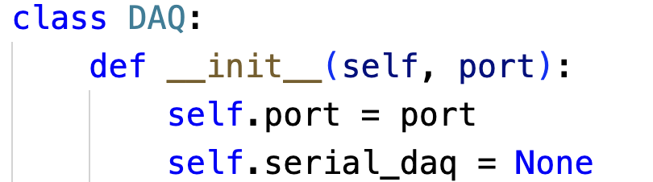
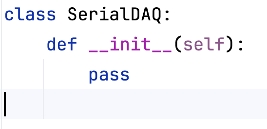

I have tested both PyCharm and VSCode for developing Python programs, and I have no doubt of the **superiority of PyCharm**.

I have recently given a [[Python for the Lab]] workshop in which I was asked to use VSCode (on Windows). I gathered feedback from 16 participants, as well as my own. On the other hand, PyCharm has been the default editor in every workshop I gave for the past 7 years. Therefore, the observations are based on a broad pool of users with different programming levels and exposure to other IDE's. 

From a pedagogical standpoint for someone new to Python, VSCode creates too much non-pythonic overhead. It is very bad at identifying and showing typing mistakes. When it comes to importing it does nothing to help us identify missing dependencies, or finding the libraries that define the module we need. 

PyCharm does a very good job at auto-completing with our own modules. It has a great set of ways of displaying warnings if data types are incorrect. And, something **fundamental**, the default character set shows the double underscores ``__`` as two characters, while VSCode shows it as a continuous line. 

!!! image small
	

!!! image small
	

The amount of typos and inconsistencies in the code (naming variables differently, for example), shot up when introducing VSCode compared to the latest workshop in which PyCharm was used. That already means VSCode has a clear impact on cost, given the extra time it'll take for people to fix those issues down the line. 

And that's not all of it. 

Running scripts within VSCode is a total pain. It just tries to run a command on whatever it's open on the terminal. So, if you opened the Python interpreter, for example, next time you try to run your script it'll send a ``python script.py`` command to the interpreter which will simply crash. It doesn't even allow to configure entry scripts, it'll always try to run whatever file you've opened. 

Honestly, who designed this tool? 

While PyCharm does a fantastic job at working out of the box, VSCode just creates overheard. The integration between virtual environments (poetry, conda, venv) in PyCharm is very transparent and follows best-practices. Moreover, it just works on Windows. Even if you don't have Anaconda, PyCharm found a clear way of letting users manage environments, and prevents many mistakes we can make. Exactly what you expect from an IDE. 

On the other hand, VSCode does not enhance the experience. It barely follows best practices that lower complications for developers at every level. 

A clear example is the creation of a ``.venv`` folder at the root of the project. Instead of storing environments in a central place (and thus shareable between projects), having them within the code makes it much harder to move things around. Plus, invariably they'll end up being tracked in git repositories. 

Did I mention that VSCode does not update the Python path to ensure our own programs are discoverable? Took me almost an hour to understand how to make it work with the ``.env`` file ([[adding a .env file to VSCode so it finds our python module]]). 

VSCode is a flexible tool that tries to be good by installing plugins. The reality is that it will always fall short compared to a tool that was developed with a clear purpose in mind, such as PyCharm (and, by the way, all other JetBrains IDE's such as WebStorm, CLion, RustRover, etc.) will always be superior in every regard. 

My final take is that there is absolutely no reason to use VSCode when PyCharm exists. 