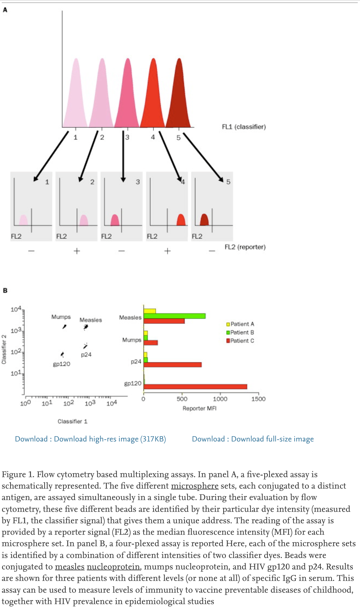

The core idea of the MBFCM technique is to use fluorescent beads coated with specific antigens (or anything else of interest). Then, a second reporter molecule can be used to quantify the number of proteins, cells, vesicles, etc. are attached to each bead. This is somewhat similar to the [[Simoa]] approach, but without single-molecule resolution. 

The image below ([@jani2002]) shows a schematic of the idea of separating information based on fluorescence spectra.

Coupling these essays with spectrally-resolved [[flow cytometer]]s, or even with [[imaging flow cytometer]] can add new dimensions to the study of small objects (such as [[extracellular vesicle]]).

Tags: #beads #fluorescence #scattering-or-fluorescence 