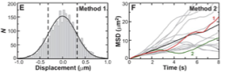

When performing [[nanoparticle tracking analysis]] measurements, there can be many different sources of error. In [@catipovic2013] they discuss several of the possible ones in order to explain the large discrepancies they observe between measured and predicted values of the diffusion coefficient (see also: [[limitations of nanoparticle tracking analysis]]). They use 550nm polystyrene spheres and track them at 10Hz with 5ms exposure time. Tracks are around 100 frames long. It is important to note that they focus on explaining the difference between the expected average value (i.e. the bulk diffusion coefficient) and not the deviations on each particle measurement. However, many of the things they discuss can be applicable, I believe. 

First, it is important to distinguish the two methods that they discuss: 

**Method 1** looks at the individual displacements $$\Delta x$$ . In a random processes we have:

$$\textrm{Var}(\Delta x) = \left< \Delta x^2\right> - \left<\Delta x\right>^2$$

For standard Brownian processes, we also have $$\left<\Delta x\right> = 0$$ 

And from here, we have that the variance is equal to the mean-squared displacement, which can be re-written as the known equation:

$$\left<\Delta x^2\right> = 2Dt$$

**Method 2** on the other hand calculates $$\left<\Delta x^2\right>$$ from the tracks themselves as:

$$\left<\Delta x^2(\tau)\right> = \frac{\sum_{i=1}^{N_i}(x(\tau_i + \tau)-x(\tau_i)^2)}{N_i}$$

One of the other method can be more robust to different sources of error. 

### Sampling Error
This is the most important source of error for both methods. The authors define it as

> the error created when only a subset of a population is sampled

At this stage is when the authors move from single-particle to bulk results. If we want to know the accuracy to determine the average diffusion coefficient, the error will be dominated by the standard deviation of the measured variances:

$$\sigma_\textrm{sampling} = \sqrt{\frac{2}{\textrm{N} -1}}$$

And, as expected, the more particles we measure the better sampling accuracy we'll get (provided there's no other source of error, of course.) There's a caveat here, though. N is the number of measurements, so for 15 particles acquired along 100 frames these are 1500 data points. It is like building a distribution of *all* the jumps. 

For method 2, however, the error scales like:

$$\sigma_\textrm{sampling}=\frac{1}{\sqrt{\textrm{N}}}$$

And here I must note that N is the number of particles. Therefore, if we only have 15 particles, etc. 

### Particle size and temperature
To compute the effect on the results that would arise from a distribution of particle sizes (around a known mean), and of temperatures (also, around a mean value), the authors performed simulations and observed how much the results depart from the expected values. The authors observed that for both method 1 and method 2 the variations in temperature or particle radius should not be factored into the calculation of error. Assuming that beads are distributed around a mean value can be fair, but I don't think is fair to assume this for temperature. I do think that most likely temperature will be different from the measured temperature and not a distribution. It does not matter if we measure 1 or 100000 tracks, there'll be a constant offset. 

### Tracking Error
This is an interesting point. Tracking error is defined as the uncertainty in time and position for each particle. The localization of the particle is limited by the number of photons, shot noise, etc. In the simulations, it is very interesting to see that this error has a larger impact on method 1 than on method 2. The authors conclude that this is the case because the tracking error is relatively large compared to the changes of positions between frames, but not compared to the total length of a track. 

## Drift or vibrational noise
The authors added a drift of 200nm/s and vibrational noise with a standard deviation of 100nm. In this case, method 1 gives a D 11% larger, while method 2 gives a D 18% larger. They also note that if the drift is increased to around $$1\mu m/s$$ then the result **can be off by a factor 10 or more!** 

Therefore, the most important source of uncertainty that people must consider is the drift, which is hard to remove if there is evaporation, or any other kind of fluid flow. Sadly, the authors do not mention the possibility of reducing the drift numerically, by comparing the traces of particles that should be uncorrelated. 

## Conclusions
Method 2 suffers more from sampling errors than Method 1. The only way to reduce the errors in method 2 is by increasing the number of tracks recorded. Therefore, if one can improve the tracking accuracy, method 1 seems to give better results. 

Tags: #nta #nanoparticle-tracking-analysis #sources-of-error #uncertainty