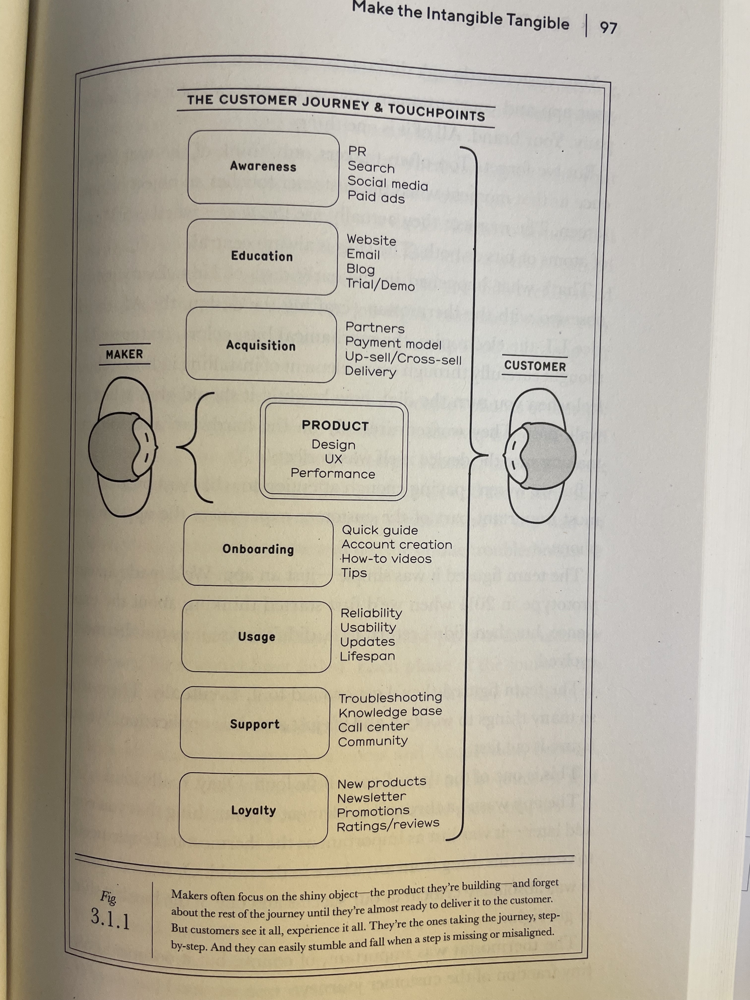

In the book [[Build - Tony Fadell]], there is a chapter discussing how to make the intangible tangible, and it discusses the value of prototyping. Specifically, it discusses about prototyping the entire customer journey and not just the shiny object, the product. 

This is essential to understanding what are the areas of improvement and what are the areas that will make the customer take the decision of going with us and not someone else. 

In this light, when building Nest, Fadell discusses the importance of self-installation for the success of the company. And it was through prototyping and early evaluation that they found out what the bottlenecks were. 

It is also important to note that the user will interact with the company many times both before as well as after purchasing our products. 

In that regard, the instructions on how to achieve something, for example, can be read beforehand to see whether it is possible to do what we expect and lower surprises. 

Somehow, these ideas resonate a lot with [[jobs theory]], but they are not completely formalized. I think there can be value in creating a discussion around [[jobs theory and customer journeys]]. 