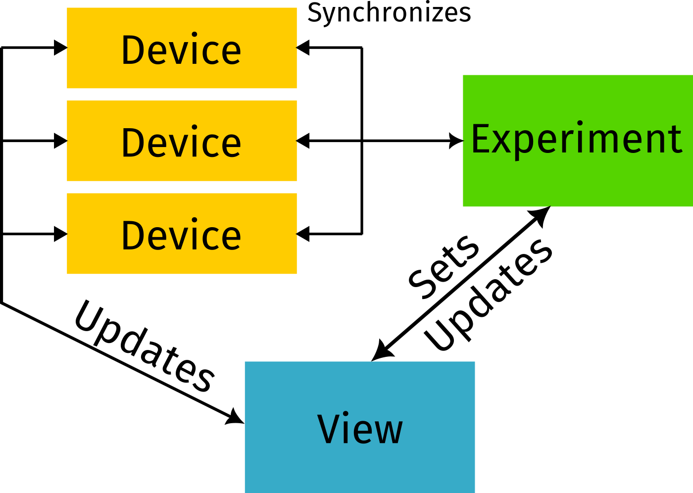

When working with [[instrumentation software]], it is important to identify patterns that repeat in order to abstract them and ease the introduction of new people to the world of [[Hardware Control]]. For a very long time, I have been proposing the use of the [[model view controller]] as a pattern for the programs I was designing. 

However, two things became apparent: I was hardly ever programming the *controller*. Since more and more companies start providing drivers compatible with Python, I started relying on it rather than developing it myself. 

The second, is that I always had two types of models: the *experiment* and the *device* model. And the use case became clear: One experiment uses many devices to achieve the expected goal. 

Therefore, I think representing software in a new pattern is very useful: 

Devices represent the interface with the real world. They acquire data, but they are also in charge of storing, processing, etc. 

The experiment is responsible for executing the measurement. Checking the devices, triggering them, etc. The experiment is where the procedural approach to performing an experiment is expressed. 

Finally, the view is the interface that gets presented to the user. In this case, there are many different use-cases: A GUI can be useful for *some* contexts, while for others a command-line-interface will be enough. Another interesting pattern to explore is the use of Jupyter Notebooks, where code can be dynamically altered (for instance, it is possible to subclass a device and change one of its methods, etc.)

I believe the **device-experiment-view** better represents the flow in which I have been developing software for the past few years, especially since I stopped caring so much about building my own drivers in Python. 