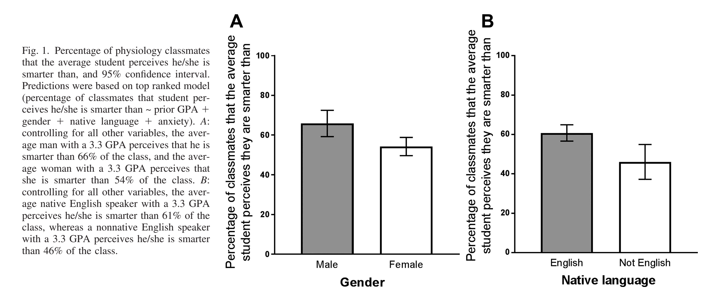

Male-students of biology have higher self-concepts (@cooper2018) than female students. This leads to male students engage more in group discussions and therefore can shape the entire active-learning experience in detriment of the female students. 

Can this be related to the [[brilliance bias]]? 

Tags: #active-learning #bias-in-education #gender-bias 