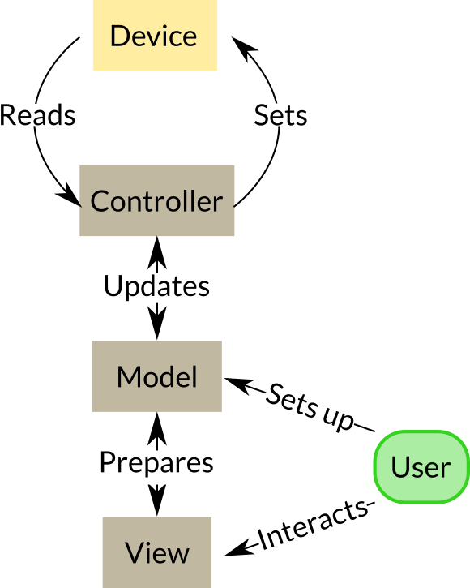

I was exposed to the MVC [[software design pattern]] through [[Django]]. In that context, the relationship with instrument control is quite evident: controllers take care of data accessing, either databases, cache, etc. For [[instrumentation software]], that means the driver that controls the device. 

In most cases, that job is done only once. Django provides many back-ends for different databases, or there specific packages. For instruments, many vendors provide the drivers, possibly already in [[Python]]. 

The model is where most development time is spent. That is the logic, data verification, relationship between elements. Either for websites or for instruments, models hold the logic and they use the controller to act 'on the real world'. 

Finally, the view is what the user is presented with. In Django, that's an HTML page that is rendered with the information from the model. It also includes the logic for data verification and feedback supported by the model. 

In instrumentation, the view is the User Interface. This is, perhaps, the most challenging for developers that have no experience and little guidance on how to achieve it. 

Lately, I have been thinking about replacing the MVC pattern for one which is more appropriate for [[instrumentation software]], especially considering that controllers are taken over by manufacturers or a limited number of developers. An apt name would be [[device experiment view]]. 