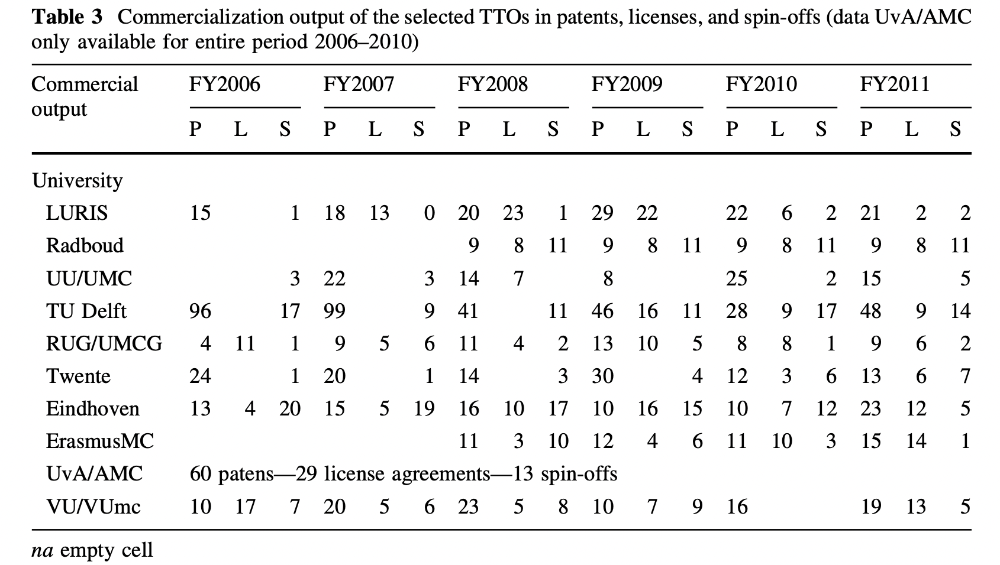

One possible way to quantify the effectiveness of [[Technology Transfer]] is to [[measure the success of technology transfer from universities by using the total number of patents, licenses and spin-offs]]. However, this procedure can't be simply add together the number of patents and spin-offs, for example, since they are very different value to the economy. Because [[patents can be awarded to ideas without empiric verification]], the value added to the economy can even be negative (patents have a cost to generate and maintain). 

Patents don’t generate *any* value in themselves. In the table of [@vinig2015] (above), for example, there are universities with more patents than licenses, or the opposite. Licenses can't be separated from the patents, since they are the only prove that there is any form of value in the intellectual property generated (patented or not). Also, since [[Patents can be used to block third parties]], they may end up being a wasteful metric more than a success indicator.  

(follow up: [[Science after WWII has stagnated]] or [[correlating GDP to scientific productivity is a reasonable proxy for progress]]). 

Tags: #economic-growth-indicators #patents #spin-offs #scientific-management #technology-transfer 